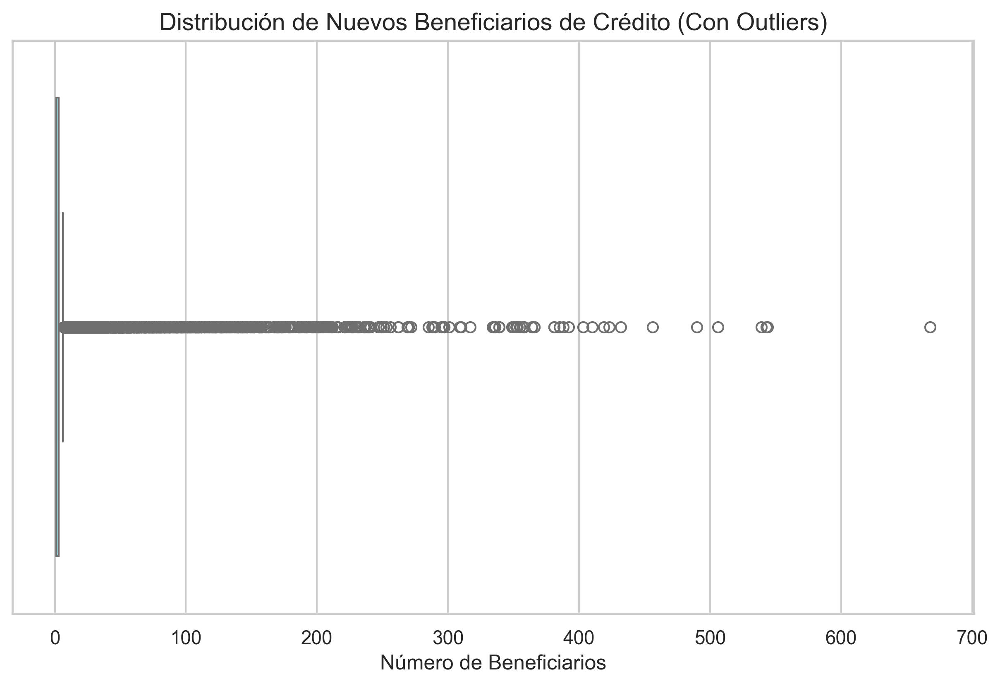
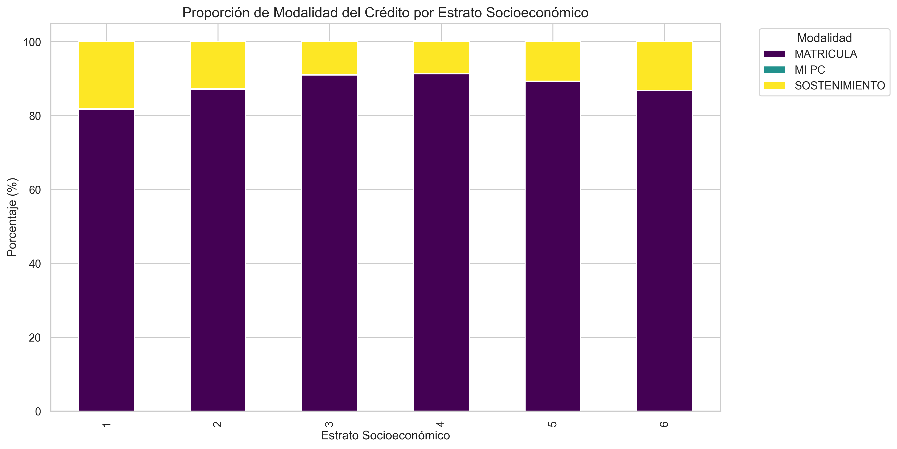
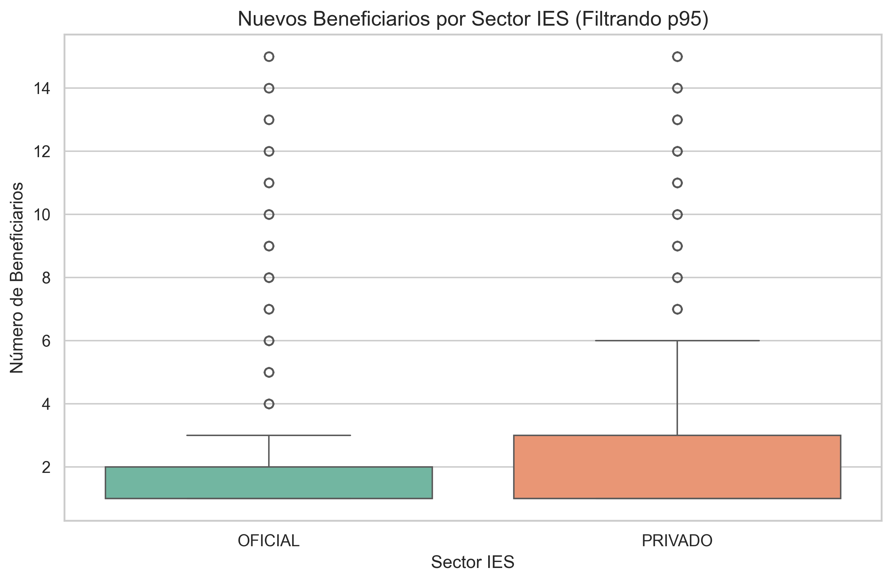
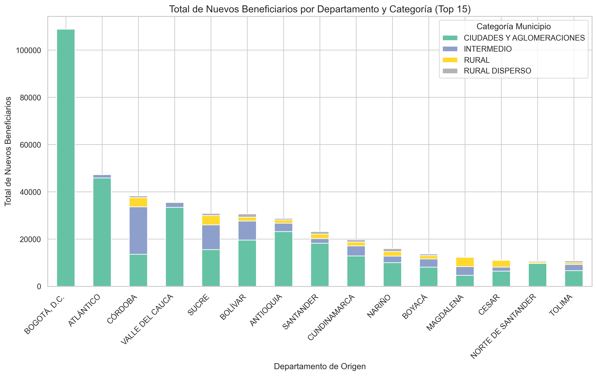
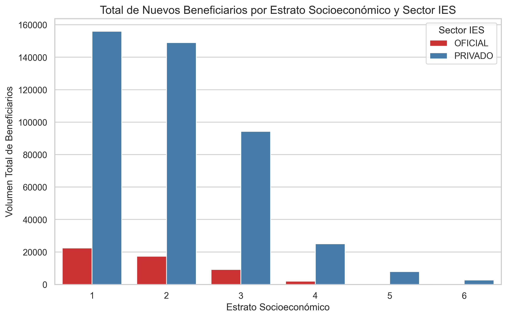

# Proyecto de Ciencia de Datos: Análisis de Créditos Otorgados

**Integrantes del Grupo:**
- Daniel Avila Medina 
- Amelie Guerrero Jaramillo 
- Juan Sebastian Alvarez

## Impacto del Proyecto

Este proyecto busca analizar los patrones y tendencias en el otorgamiento de créditos educativos en Colombia, respondiendo a la pregunta: **¿De qué manera el ESTRATO SOCIOECONÓMICO y el SECTOR IES influyen en la MODALIDAD DEL CRÉDITO asignado y en el volumen del NÚMERO DE NUEVOS BENEFICIARIOS DE CRÉDITO?**

El impacto de este análisis radica en entender cómo las políticas de financiamiento educativo están alcanzando a las distintas capas sociales. Al revelar que los estratos más bajos dependen drásticamente de los créditos de sostenimiento y que las instituciones privadas absorben la inmensa mayoría de la masa de créditos, los tomadores de decisiones pueden reestructurar los beneficios gubernamentales para ofrecer mayor equidad o ampliar la oferta pública, democratizando el acceso a la educación superior en regiones marginadas.

## Hallazgos Principales

### 1. Asimetría en la Asignación de Beneficiarios
La gran mayoría de los créditos se otorgan para grupos muy reducidos (entre 1 y 3 beneficiarios), sin embargo, existen operaciones excepcionales que agrupan hasta 668 beneficiarios en una sola solicitud.

### 2. Dependencia del Sostenimiento según Estrato
Se evidencia una dependencia marcada del subsidio de "SOSTENIMIENTO" en los estratos 1 y 2, los cuales tienen el doble de proporción en esta modalidad comparados con los estratos más altos.

### 3. Predominancia del Sector Privado
Las Instituciones de Educación Superior (IES) de carácter Privado no solo acaparan la mayor cantidad de créditos en volumen, sino que la cantidad de beneficiarios promedio por registro también es superior al sector Oficial.

### 4. Centralización en Grandes Ciudades
Bogotá lidera la cantidad de beneficiarios, seguida de Atlántico y Valle del Cauca. Adicionalmente, el análisis muestra cómo las categorías "Ciudades y Aglomeraciones" dominan la recepción de créditos frente a los municipios intermedios o rurales.

### 5. Demanda del Sector Privado en Estratos Vulnerables
Al cruzar el Estrato con el Sector IES y el volumen de beneficiarios, notamos que los estratos 1 y 2 dependen masivamente del financiamiento para acceder a instituciones PRIVADAS (superando por mucho a las oficiales). Esto refleja que el crédito actúa como el principal motor de inclusión hacia el sector privado para estudiantes de bajos recursos.

## Conclusiones de la Vista Minable

Tras aplicar técnicas de preparación de datos (Limpieza de nulos e inconsistencias, normalización, discretización de estratos y numerización tipo *One-Hot Encoding*), la base de datos resultante (`vista_minable.csv`) queda optimizada para entrenar modelos predictivos que puedan, por ejemplo, anticipar la demanda de créditos futuros por región o identificar perfiles de estudiantes en riesgo de deserción financiera.

## Modelo Predictivo: Clasificación de Estrato

Como valor añadido a la vista minable, desarrollamos un modelo en la carpeta `modelo_predictivo/` que entrena un **Random Forest Classifier** para predecir si un beneficiario pertenece a un *Estrato Bajo* (1 o 2) utilizando características como su Sexo, Sector de IES, Modalidad del Crédito y Ubicación. 

**Hallazgos del Modelo:**
1. **Precisión:** El modelo logró una alta capacidad de generalización al acercarse a la proporción de estrato bajo real del grupo de prueba (Ground Truth interno de la vista minable: **62.25%**, Predicción: **57.13%**).
2. **Importancia de Variables:** Gracias al Random Forest, extrajimos que el vivir en una 'Ciudad o Aglomeración' y estar matriculado en el 'Sector Privado' son los factores de mayor peso matemático para catalogar a un estudiante como perteneciente a estrato bajo, ratificando el análisis visual exploratorio previo.

**Utilidad e Impacto Social de estos Modelos:**
La gran ventaja de haber consolidado una `vista_minable.csv` tan robusta es que permite escalar este análisis inicial hacia modelos predictivos mucho más complejos. Un modelo como el que hemos entrenado tiene utilidades reales de alto impacto:
- **Focalización de Recursos:** Al predecir qué características definen a la población más vulnerable (Estrato Bajo), entidades gubernamentales pueden priorizar y redirigir subsidios o campañas de financiamiento directamente a estudiantes en ciudades intermedias o rurales buscando entrar al sector privado.
- **Prevención de Deserción:** Modelos futuros podrían entrenarse para identificar anticipadamente (basándose en la modalidad de crédito y nivel de formación) qué perfil de estudiante tiene un alto riesgo de deserción o morosidad, permitiendo brindarles tutorías financieras o apoyos de sostenimiento *antes* de que abandonen la universidad.
- **Inclusión Financiera Inteligente:** Este modelo demuestra que, matemáticamente, los datos cuentan la historia de la inequidad. La vista minable sienta las bases para construir una IA de adjudicación de créditos justa que evalúe y fomente la asignación de cupos a minorías y mujeres en formación avanzada (como evidenciamos en el EDA).
